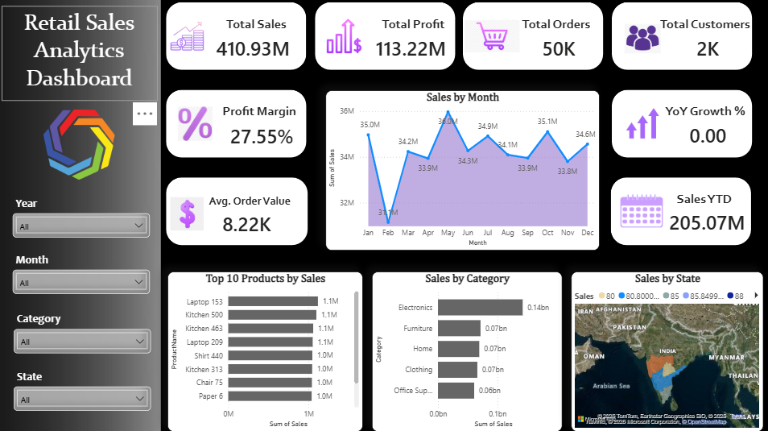
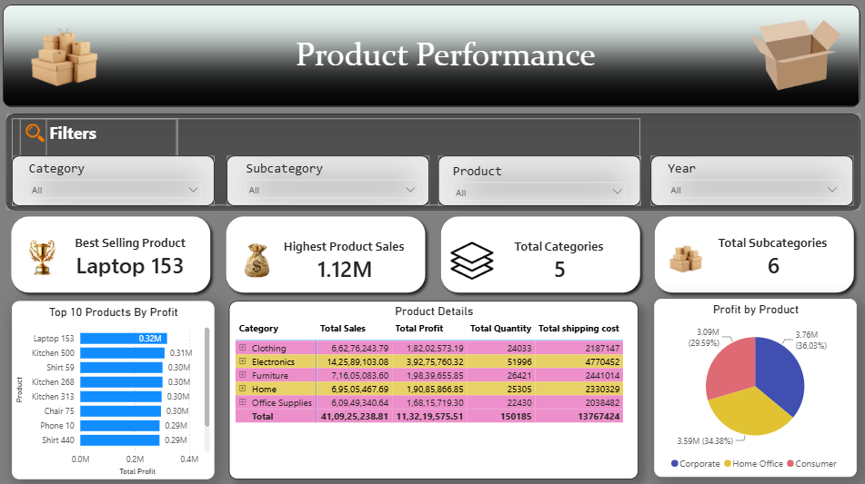
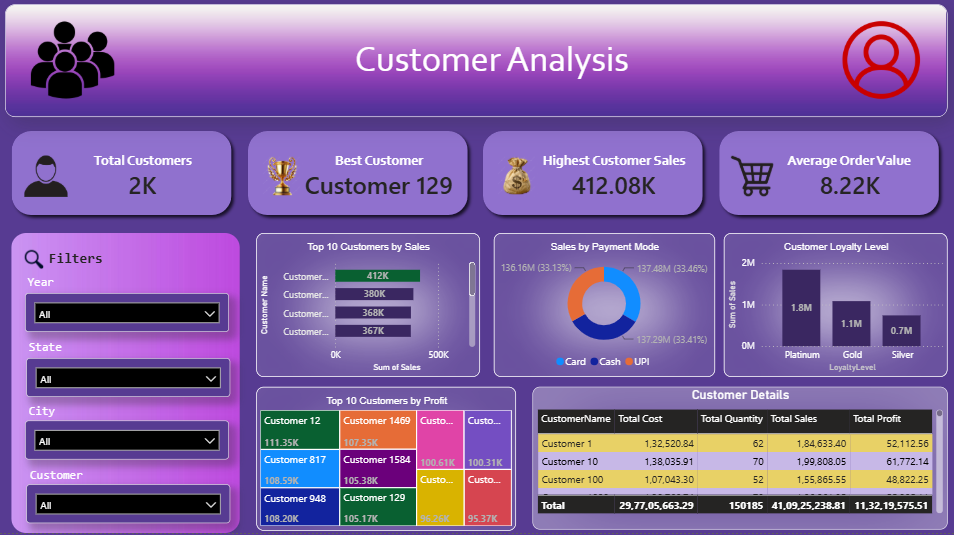
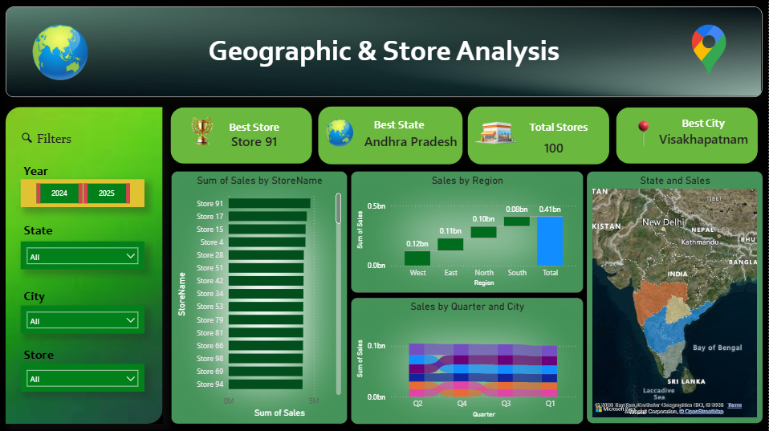
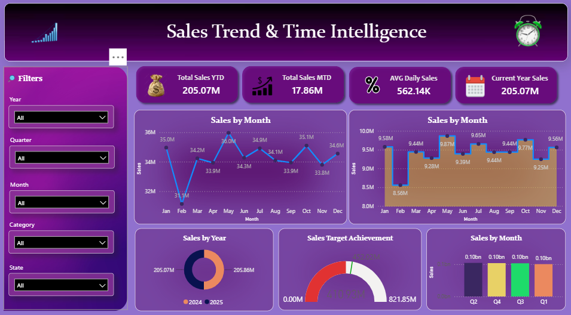
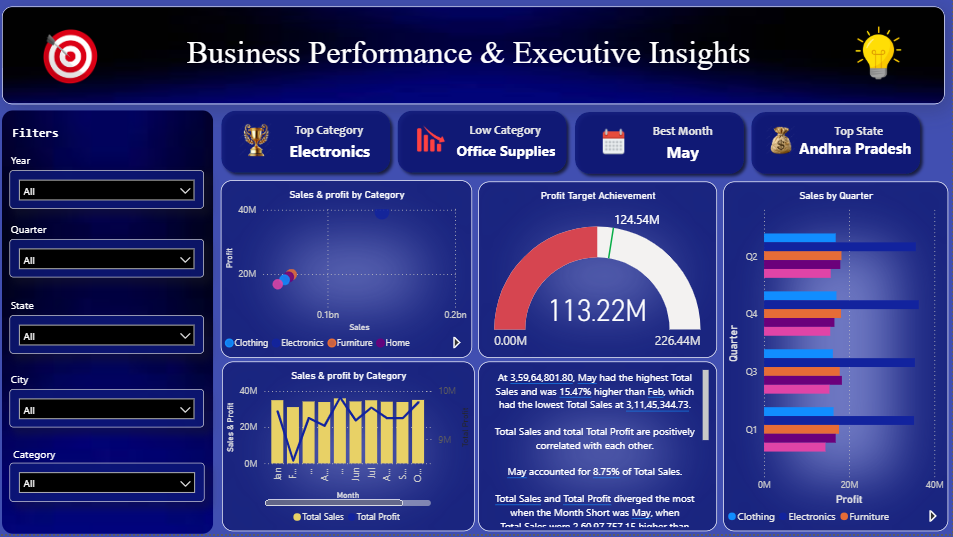

# 📊 Retail Sales Analytics Dashboard

An end-to-end **Business Intelligence Dashboard** built using **Power BI** to analyze retail sales performance, customer behavior, product performance, and business profitability. This project demonstrates data modeling, SQL analysis, Power Query transformations, DAX calculations, and interactive dashboard development.

---

# 🎯 Project Objective

The goal of this project is to transform raw retail sales data into meaningful business insights through an interactive Power BI dashboard that helps decision-makers monitor KPIs, identify trends, and improve business performance.

---

# ⭐ Project Highlights

- Interactive 6-page Power BI Dashboard
- 20+ DAX Measures
- 20 SQL Business Analysis Queries
- Star Schema Data Model
- KPI Cards and Gauge Charts
- Sales Target vs Actual Analysis
- Customer, Product, and Store Analytics
- Time Intelligence using DAX

# 🛠️ Tools & Technologies

- 📊 Power BI Desktop
- 🧮 DAX (Data Analysis Expressions)
- 🗄️ SQL Server
- 🔄 Power Query
- 📑 Microsoft Excel / CSV
- 🌐 GitHub

---

# 📈 Dashboard Features

### 📌 Executive Summary
- Total Sales
- Total Profit
- Profit Margin
- Total Orders
- Total Customers
- KPI Cards

### 📦 Product Analysis
- Product Category Performance
- Top Selling Products
- Product Sales Comparison

### 👥 Customer Analysis
- Customer Segmentation
- Top Customers
- Customer Purchase Analysis

### 🌍 Geographic & Store Analysis
- Sales by State
- Sales by City
- Store Performance

### 📅 Sales Trend Analysis
- Monthly Sales Trend
- Monthly Profit Trend
- Quantity Sold
- Trend Analysis

### 📊 Executive Insights
- Sales Target vs Actual
- Profit Target vs Actual
- KPI Gauges
- Business Performance Overview

---

# 📸 Dashboard Preview

## Executive Summary



## Product Analysis



## Customer Analysis



## Geographic & Store Analysis



## Sales Trend Analysis



## Executive Insights



---

# 📊 Key KPIs

- Total Sales
- Total Profit
- Profit Margin %
- Total Orders
- Total Customers
- Average Order Value
- Sales Growth %
- Profit Growth %
- Sales Target
- Profit Target

---

# 💡 Key Business Insights

- Identified the top-performing products and categories.
- Compared store performance across different locations.
- Analyzed customer purchasing behavior.
- Evaluated monthly sales and profit trends.
- Compared actual business performance with predefined targets.
- Built interactive dashboards for business decision-making.

---

# 🧮 SQL Skills Demonstrated

- SELECT
- WHERE
- ORDER BY
- GROUP BY
- Aggregate Functions
- INNER JOIN
- Window Functions
- Business Analysis Queries

---

# 📊 DAX Skills Demonstrated

- SUM()
- CALCULATE()
- DIVIDE()
- DISTINCTCOUNT()
- TOTALYTD()
- SAMEPERIODLASTYEAR()
- Time Intelligence
- KPI Measures
- Target vs Actual Analysis

---

# 📂 Repository Structure

```text
Retail-Sales-Analytics-Dashboard
│
├── README.md
├── Retail_Sales_Analytics.pbix
│
├── Dataset
│   ├── Customers.csv
│   ├── Products.csv
│   ├── Stores.csv
│   └── FactSales.csv
│
├── SQL
│   ├── 01_Basic_Queries.sql
│   ├── 02_Aggregate_and_GroupBy.sql
│   ├── 03_Joins_and_Business_Analysis.sql
│   └── 04_Advanced_SQL.sql
│
├── DAX
│   └── All_DAX_Measures.md
│
└── Screenshots
    ├── 01_Executive_Summary.png
    ├── 02_Product_Analysis.png
    ├── 03_Customer_Analysis.png
    ├── 04_Geographic_Analysis.png
    ├── 05_Sales_Trend.png
    └── 06_Executive_Insights.png
```

---

# 🚀 How to Use

1. Download or clone this repository.
2. Open `Retail_Sales_Analytics.pbix` using **Power BI Desktop**.
3. Refresh the dataset if required.
4. Explore the interactive dashboard.

---

# 👨‍💻 Author

**Lokesh**

**Aspiring Data Analyst**

### Skills

- SQL Server
- Power BI
- DAX
- Power Query
- Data Modeling
- Microsoft Excel
- Business Intelligence

---

⭐ If you found this project useful, consider giving this repository a **Star** on GitHub.
